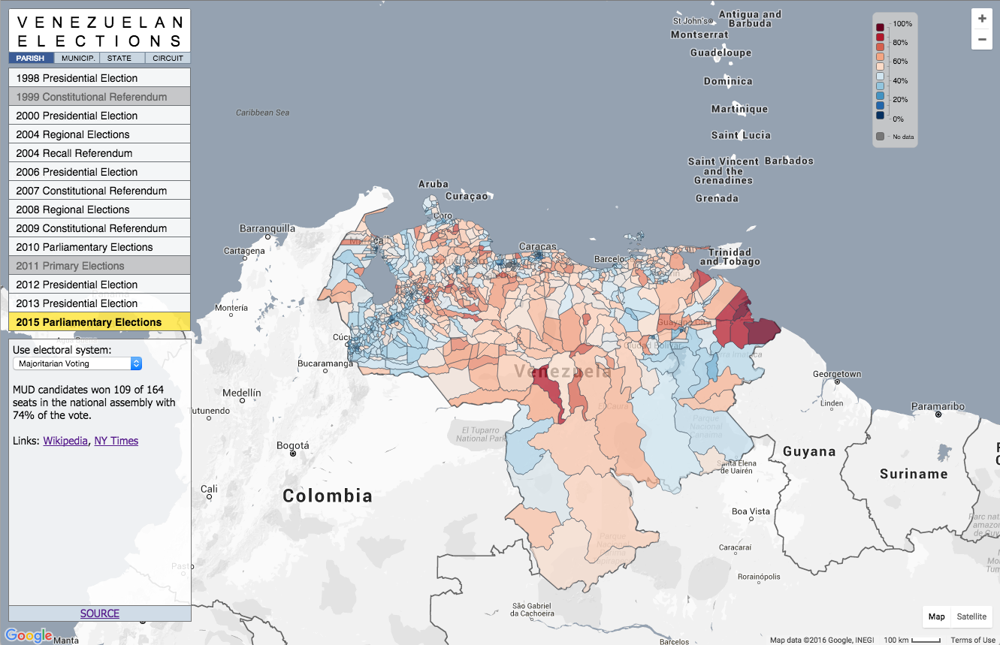

# venezuelan-elections-map

Source code of interactive map to browse local returns for all Venezuelan elections since 1998:
http://stanford.edu/~dkronick/vzmap



### Installation

To build and host this project locally for development, you must have [Git](http://git-scm.com/), [NPM](https://www.npmjs.com/), [Grunt](http://gruntjs.com/) and [Bower](http://bower.io/) installed in your environment.

First, clone a copy of the repository to your local system:
```
git clone https://github.com/CaracasChronicles/venezuelan-elections-map.git
```

You must then edit the ```settings.json``` file and enter your own Google API key in order to access Google Maps.  Instructions on how to generate your own API key can be found in [this section of the Google Maps API documentation](https://developers.google.com/maps/documentation/javascript/tutorial#api_key).  You may optionally provide a tracking ID if you intend to use Google Analytics.

After editing the ```settings.json``` file, if you intend to commit changes to the project and push them elsewhere, you may want to tell git not to include the changes you made to ```settings.json``` with this command:
```
git update-index --assume-unchanged settings.json
```

Run the following commands from within the project folder to complete the build:

```bash
npm install
bower install
grunt
```

If build is successful, the final project files will be generated under the `dist` folder.

To run the built-in webserver locally for testing or development, simply run ```grunt server``` then point your browser to [http://localhost:4660/](http://localhost:4660/) to see the map.  Live reload is enabled, meaning any modifications made to source files while the webserver is running will trigger Grunt to rebuild dependencies and reload the page automatically to reflect new changes.

### Credits

Site development by Christian Font; raw data from the Venezuelan electoral council (CNE) via [ESDATA](http://esdata.info/); data processing by [Dorothy Kronick](http://dorothykronick.com/). Thanks to Stanford University's Community Engagement Grant for funding and to Javier Rodríguez Rivas for research assistance.

Additional credit goes to Seth Yastrov for his python-fu, [D3.js](http://d3js.org/) and [Colorbrewer 2.0](http://colorbrewer2.org/).
